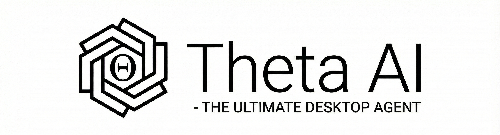
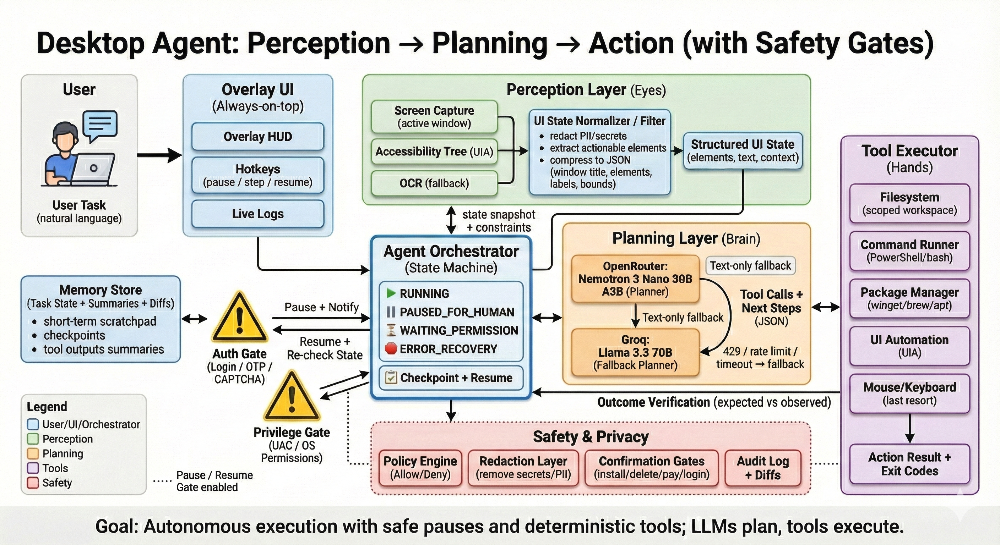

<p align="center">
  
</p>

<h1 align="center">Theta AI</h1>

<p align="center">
  <strong>An autonomous AI agent for desktop automation powered by large language models</strong>
</p>

<p align="center">
  <em>Status: Alpha / Proof of Concept</em>
</p>

---

## Overview

Theta AI is an experimental AI agent that automates desktop tasks through a perception-planning-action loop. It uses computer vision to understand screen state, LLMs to plan actions, and integrates multiple automation tools to execute tasks across desktop applications and web browsers.

**Warning:** Theta AI can control your computer but requires user approval for sensitive operations. Use in a safe environment and supervise all actions. This is experimental software not intended for production use.

---

## Features

- Autonomous task execution via natural language commands
- Screen perception through OCR and UI element detection
- LLM-based action planning (Groq/Llama 3.3 70B)
- Multi-tool orchestration (browser, desktop apps, file system)
- Permission gates for destructive, payment, and login operations
- Voice command support with wake word detection
- Real-time overlay interface for monitoring
- Audit logging for all executed actions

---

## Architecture

<p align="center">
  
</p>

The agent operates in a continuous loop with built-in safety checks:

1. **Perceive** - Capture and analyze screen state using OCR
2. **Plan** - Use LLM to determine next action based on current state
3. **Safety Check** - Request approval for sensitive operations
4. **Execute** - Call appropriate tool to perform action
5. **Verify** - Check completion status or handle errors

---

## Prerequisites

- Python 3.10 or higher
- Windows 10/11 (for full desktop automation support)
- Groq API key (free tier available at groq.com)
- 8GB RAM minimum (16GB recommended for OCR)

---

## Installation

### 1. Clone Repository

```bash
git clone https://github.com/yourusername/theta-ai.git
cd theta-ai
```

### 2. Create Virtual Environment

```bash
python -m venv .venv
```

**Windows:**
```bash
.venv\Scripts\activate
```

**macOS/Linux:**
```bash
source .venv/bin/activate
```

### 3. Install Dependencies

```bash
pip install -r requirements.txt
```

### 4. Install Playwright Browsers

```bash
playwright install chromium
```

### 5. Configure Environment

Create a `.env` file in the project root:

```
GROQ_API_KEY=your_groq_api_key_here
```

To obtain a Groq API key:
1. Visit console.groq.com
2. Sign up for free account
3. Navigate to API Keys section
4. Create new key and copy to `.env` file

---

## Usage

### Overlay Mode (Recommended)

Launch the graphical interface:

```bash
python -m agent.main --overlay
```

Type commands in the input field or use voice with "Hey Theta" wake word.

### Command Line Mode

Execute single task:

```bash
python -m agent.main "open notepad and write hello world"
```

### Interactive Mode

Enter interactive shell:

```bash
python -m agent.main --interactive
```

Commands are entered at the prompt:

```
> open calculator and compute 45 times 67
> search for python tutorials on bing
> quit
```

---

## Examples

**Desktop Applications:**
```bash
python -m agent.main "open notepad and write hello world"
python -m agent.main "launch calculator and calculate 123 plus 456"
python -m agent.main "open camera and take a photo"
```

**Web Browser:**
```bash
python -m agent.main "search for AI news on bing and open first result"
python -m agent.main "go to github.com"
```

**File Operations:**
```bash
python -m agent.main "create file notes.txt in workspace"
python -m agent.main "list files in workspace directory"
```

**Voice Commands (Overlay Mode):**
```
"Hey Theta, open notepad"
"Hey Theta, search for python documentation"
"Hey Theta, take a screenshot"
```

---

## Configuration

Edit `agent/config.py` to modify settings:

```python
# LLM Configuration
LLM_PROVIDER = "groq"
LLM_MODEL = "llama-3.3-70b-versatile"
MAX_ITERATIONS = 15

# Workspace
WORKSPACE_DIR = Path.home() / "agent_workspace"

# Voice
ENABLE_VOICE = True
VOICE_WAKE_WORD = "hey theta"

# Safety Policies
SAFETY_POLICIES = {
    "destructive_operations": ["delete", "remove", "format", "kill"],
    "payment_operations": ["buy", "purchase", "checkout", "payment"],
    "login_operations": ["login", "signin", "password", "authenticate"]
}
```

---

## Project Structure

```
theta-ai/
├── agent/
│   ├── core/
│   │   ├── orchestrator.py       # Main agent loop
│   │   ├── llm_client.py         # LLM API integration
│   │   ├── prompts.py            # System prompts
│   │   └── state_machine.py      # State management
│   │
│   ├── tools/
│   │   ├── browser.py            # Browser automation (Playwright)
│   │   ├── ui_automation.py      # Desktop app control (pywinauto)
│   │   ├── mouse_keyboard.py     # Input simulation
│   │   ├── app_controller.py     # Application launcher
│   │   ├── filesystem.py         # File operations
│   │   ├── command_runner.py     # Shell command execution
│   │   └── base_tool.py          # Tool interface
│   │
│   ├── perception/
│   │   ├── screen_capture.py     # Screen analysis and OCR
│   │   └── voice_input.py        # Speech recognition
│   │
│   ├── planning/
│   │   └── task_planner.py       # Task decomposition
│   │
│   ├── safety/
│   │   ├── permission_gate.py    # Permission management
│   │   └── audit_log.py          # Action logging
│   │
│   ├── ui/
│   │   ├── overlay.py            # GUI interface (Tkinter)
│   │   └── overlay_agent.py      # Agent runner
│   │
│   ├── config.py                 # Configuration settings
│   └── main.py                   # Entry point
│
├── assets/                       # Icons and resources
│   ├── logo.png
│   ├── full_logo.png
│   ├── architecture.png
│   ├── activeMic.png
│   ├── inactiveMic.png
│   ├── send.png
│   └── pause.png
│
├── .env                          # Environment variables (gitignored)
├── .gitignore
├── requirements.txt              # Python dependencies
├── LICENSE                       # MIT License
└── README.md
```

---

## Safety Features

### Permission System

Theta AI requests explicit user approval before executing sensitive operations:

**Destructive Operations**
- File deletion or removal
- System shutdowns or restarts
- Process termination
- Disk formatting operations

**Payment Operations**
- Online purchases
- Checkout processes
- Payment form submissions

**Login Operations**
- Password entry
- Authentication forms
- Account credential input

### Permission Dialog

When a sensitive action is detected, Theta AI displays an approval dialog:

**Overlay Mode:**
```
⚠️  PERMISSION REQUIRED

Action: Delete file
Description: Remove important_document.txt
Risk Level: High

[Approve] [Reject]
```

**CLI Mode:**
```
⚠️ Permission Required
Action: Delete file
Description: Remove important_document.txt
Approve this action? (y/n):
```

### Audit Logging

All actions are logged to `agent_workspace/audit_log.json` with:
- Timestamp
- Action type and parameters
- Approval status
- Execution result
- User identity (for multi-user setups)

### Additional Safety Measures

- Task iteration limit prevents infinite loops
- Loop detection identifies repeated actions
- File operations restricted to workspace directory
- Real-time action monitoring through overlay interface
- Sensitive data pattern detection (SSN, credit cards)

---

## Known Limitations

- Windows-only for desktop automation (Linux/macOS support planned)
- OCR accuracy varies with screen resolution and font size
- Single task execution (no parallel processing)
- LLM planning can occasionally select incorrect actions
- Browser automation may fail on sites with complex JavaScript
- No automatic rollback of executed actions
- Voice recognition requires clear audio input

---

## Development

### Running Tests

```bash
pytest tests/
```

### Code Formatting

```bash
black agent/
isort agent/
```

### Linting

```bash
flake8 agent/
pylint agent/
```

---

## Contributing

Contributions are welcome. Please follow these guidelines:

1. Fork the repository
2. Create feature branch (`git checkout -b feature/description`)
3. Commit changes (`git commit -m 'Add feature'`)
4. Push to branch (`git push origin feature/description`)
5. Open Pull Request

### Areas for Contribution

- Cross-platform support (Linux, macOS)
- Additional tool integrations (email, calendar, Slack)
- Improved error handling and recovery
- Test coverage expansion
- Documentation improvements
- Bug fixes and performance optimizations

---

## Roadmap

**Version 0.2**
- Linux and macOS desktop automation support
- Multi-tab browser management
- Enhanced error recovery mechanisms
- Comprehensive test suite

**Version 0.3**
- Memory system for task history
- Plugin architecture for custom tools
- Multi-monitor support
- Advanced vision model integration

**Version 1.0**
- Production-ready stability
- Enterprise security features
- Performance optimizations
- Complete documentation

---

## License

MIT License - see LICENSE file for details.

---

## Acknowledgments

Built with open source libraries:

- Groq - LLM inference
- EasyOCR - Text recognition
- Playwright - Browser automation
- pywinauto - Windows UI automation
- PyAutoGUI - Input control

---

## Support

- **Issues:** GitHub Issues
- **Discussions:** GitHub Discussions
- **Documentation:** Wiki

---

## Disclaimer

This software is provided "as is" without warranty of any kind. Use at your own risk. The authors are not responsible for any damage or data loss caused by this software. Always supervise automated actions and maintain backups of important data.

